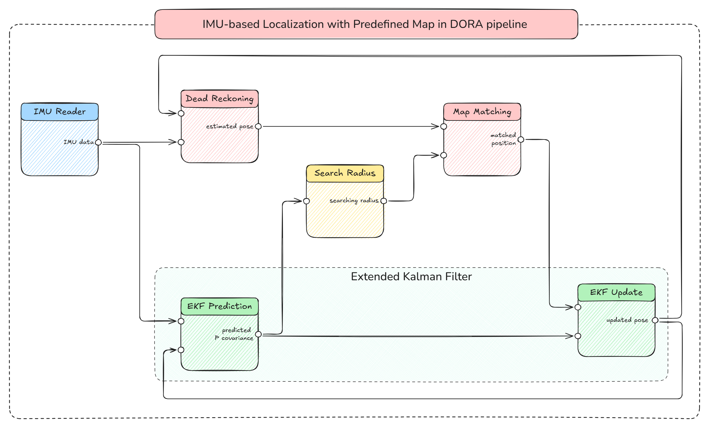

# DORA IMU EKF Map-Matching Pipeline

A DORA-based localization pipeline for IMU-driven navigation using Extended Kalman Filter (EKF) assisted map matching.

This project focuses on robust localization by combining:
- IMU sensor data
- Probabilistic state estimation with EKF
- Map-based correction / matching
- Modular DORA pipeline nodes

The goal is to improve localization accuracy in environments where GPS signals are unavailable or unreliable.

---

## 🚀 Features
- 📡 IMU-based dead reckoning
- 🔄 Extended Kalman Filter sensor fusion
- 🗺️ Pseudo measurement using map matching algorithm
- ⚙️ Modular DORA pipeline architecture
- 📊 Trajectory and state visualization

---
## 🌐 Node I/O Connections

---

## 📂 File Overview

- **data/**: Input datasets and map data for experiments.
- **.gitignore**: Git ignore rules for data, logs, and temporary files.
- **dataflow.yaml**: DORA pipeline configuration.
- **dead_reckoning.py**: IMU-based motion propagation.
- **find_searching_radius.py**: Search radius for candidate selection in map matching.
- **fusion.py**: Unused
- **imu_reader.py**: IMU data loading and preprocessing.
- **map_loader.py**: Map data loading utilities.
- **map_matching.py**: Trajectory-to-map alignment logic.
- **predict_ekf.py**: EKF prediction step for computing covariance P.
- **update_ekf.py**: EKF correction/update step.
- **visualizer.py**: Result plotting and trajectory visualization.
